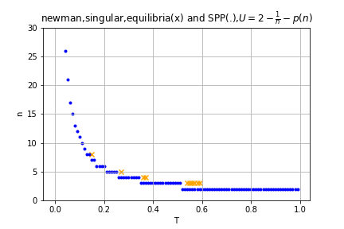

## Contagion spread, singular degree distribution

Suppose every agent is identical and chooses $$n$$ connections. The degree distribution is described by $$p_n=1$$.

- Var $$T$$ is transmissibility of the contagion. 
    - Assume $$T$$ is the same for all connections.
    - It can be interpreted as the apriori chance that the disease potentially transmits along an edge (meaning the edge is "open"; transmission won't actually occur if neither person involved gets sick.)
    - Don't worry about the timing involved. (percolation theory)

Following Newman, look at the the probability generating functions for the spread of this disease.

- PGF for number of neighbors: $$G_0(x)=\sum_k p_k x^k = x^n$$
- PGF for excess degree of random neighbor: $$G_1(x)=\frac{G'_0(x)}{\mu}=x^{n-1}$$
- PGF for number of transmissible connections: $$G_0(x;T)=G_0(1-(1-x)T)=(1-[1-x]T)^n$$
- PGF for number of neighbor's transmissible excess edges: $$G_1(x;T)=G_1(1-(1-x)T)=(1-[1-x]T)^{n-1}$$
- Critical Transmissibility threshold $$T_c = 1/G'_1(1) = \frac{1}{n-1}$$
- (Meyers Newman et al 2004) $$R_0 = T(\frac{E[k^2]}{E[k]}-1) = T(n-1)$$
- Chance that end of random edge remains uninfected determined implicitly by $$U=G_1(U;T) = (1-(1-U)T)^{n-1}$$
    - No disease $$U=1$$ is always a solution, 
        - and is the only solution if $$G'_1(1;T)=(n-1)T\geq 1$$ <!--because of concavity-->
    - Full infection $$U=0$$ is only a solution if $$T=1$$.
    - Otherwise if $$(n-1)T < 1$$, there exists a unique solution $$U\in(0,1)$$.
        - Unfortunately, can't be  solved in closed-form, but easy to approximate numerically
        - See [numsolve_newman_singular.py](numsolve_newman_singular.py) for an example using numpy
- Chance that outbreak causes epidemic = fraction of population that gets infected = $$R_\infty = 1-G_0(U;T) =1-(1-T+TU)^n$$ (called S(T) in Newman)
    - Also must, in general, be numerically solved.
    - In this case, $$R=1-(1-T+TU)U=1-(1-T)U-TU^2$$, so holding T fixed, $$1-R$$ will be a weighted average of $$U$$ and $$U^2$$
        - That is, the chance that one of your neighbors stays healthy is at most the chance *nobody else* gets them sick, and at least that chance squared.
        - Higher transmission means $$1-R$$ closer to $$U$$, lower transmission means its farther away (holding U equal, allowing n to vary)
        - Also, in this case $$U = \sqrt{\frac{1-R}{T} + \left(\frac{1-T}{2T}\right)} - \frac{1-T}{2T}$$, but that doesn't have any intuitively obvious interpretation. Nice to know for later that it's uniquely determined by aggregate facts about the disease.
- In this case, infected and uninfected people won't differ in degree distribution (duh)
<!--    - Probability that person has degree $$k$$ given that they don't get sick: $$p_k (1-T+TU)^k / \sum_j p_j (1-T+TU)^j = 1$$
    - PGF for degree of uninfected people: $$x \mapsto G_0([1-T+TU]x)/G_0(1-T+TU)$$
    - Mean degree of uninfected: $$[1-T+TU]G'_0([1-T+TU]) \over G_0([1-T+TU])$$ = n.
    - PGF for infected degree distribution: $$\frac{G_0(x)-G_0([1-T+TU]x}{q-G_0(1-T+TU)}$$-->

<!--March 21 notes are different because I ignored the excess degree construction from Newman. If every vertex has degree three, then critical T_c is 1/2 because one of those edges is how people *get sick* in the first place. The chance that a random outbreak causes a pandemic (equal to size of pandemic) is the chance that at least one of those *3* initial neighbors -->,

## Contagion Risk

The previous section covers the spread of contagion through population. 
This section covers the spread to an individual

- Var $$T$$ is transmissibility of the contagion. Assume $$T$$ the same for all connections.
- Assume you personally are not patient 0 of a spontaneous outbreak.
- What is the chance that a *particular* neighbor gets sick?
    - The chance they get sick at all is $$R_\infty$$
        - But that includes the chance of getting sick *from you*, in which case they can't pass it to you.
    - Var $$U$$ is the chance that absent your connection with them, that neighbor would not get sick.
        - Thus $$1-U$$ is the chance that they have the possibility of passing it on to you.
- The chance that the contagion is transmitted to you from any particular neighbor is $$(1-U)T$$.
    -  Var $$\Psi \equiv (1-U)T$$ 
- The chance that none of your neighbors transmits to you is $$\left[1-\Psi\right]^{n}$$.
- The chance that *at least* one neighbor transmits to you is $$p(n) = 1-\left[1-\Psi \right]^{n}$$.
    - In this setup, $$p(n)=R_\infty$$, though with variation in degree, this wouldn't necessarily hold.     
    - Range of $$[0,1)$$ if $$T\in(0,1)$$

Now suppose the individual takes $$U$$ for granted, and wants to go about myopically choosing $$n$$.

- For convinence, suppose that the person cares directly about disease risk $$p(n)$$
- The risk of getting sick is increasing in $$n$$, and the marginal increase in disease risk in going from $$n-1$$ connections to $$n$$ connections is 
        
    $$p(n) - p(n-1) = \left(1 - \left[1-\Psi\right]^{n}\right) - \left(1 - \left[1-\Psi\right]^{n-1}\right) \\
    = [1-\Psi]^{n-1} - [1-\Psi]^{n} \\
    =[1-\Psi]^{n-1}\Psi > 0$$

- For any given $$n$$, as $$\Psi$$ increases, (increasing transmissibility or final prevalence), the marginal disease risk can either increase *or* decrease.
  
    $$\frac{d}{d\Psi}[p(n) - p(n-1)]  
    = -(n-1)[1-\Psi]^{n-2} + n[1-\Psi]^{n-1} \\
    = [1-\Psi]^{n-2}[-(n-1) + n[1-\Psi]] \\
    = [1-\Psi]^{n-2}[1-n\Psi]$$

- iff $$n > 1/\Psi$$, then the marginal disease risk from your $$nth$$ connection actually *decreases* as each individual contact becomes more dangerous. 

- This threshold occurs at different values of $$p(n)$$ depending on the the value of $$\Psi$$, but is bounded above by $$p(\frac{1}{\Psi}) < \frac{1}{e} \approx 37\%$$.
    - That is, if you are already more than 37% likely to get sick, a more hazardous disease might actually make you worry less about the marginal connection.
    - **Fatalism** ala Kremer 

<!--continuous version d/dn d/d\Psi) has threshold -1/lnV)-->

## Individual decision about contacts

- Var $$\delta$$ is the cost incurred by illness
- Aside from contagion, person recieves some utility $$u(n)$$ from contacts.
- Preferences are represented by $$U(n)=u(n)-\delta p(n)$$
- Myopic individual, taking $$\Psi$$ as given, chooses $$n\in\Z_+$$ to solve

    $$\max_n [u(n)-\delta p(n)] = \max_n [u(n) - \delta (1-[1-\Psi]^n)]$$

<!--maximimum connection number a la Kremer?-->    

## Equilibrium with singular distribution

Given $$T$$, a regular contagion equilbrium consists of a degree $$n\in \Z_+$$ and an edge unprevalence $$U$$ such that 
- Taking $$U$$ as given, $$n$$ solves 

    $$n = \argmax_n [u(n) - \delta + \delta (1-T+TU)^n ] \tag{preferences}$$

- This choice of $$n$$ causes the ultimate edge unprevalence to be $$U$$ satisfying:

    $$U = (1-T+UT)^{n-1} \tag{unprevalence}$$

Alternatively, in terms of the threat each neighbor poses for you, $$\Psi$$: 

$$n = \argmax_n [u(n) - \delta + \delta (1-\Psi)^n ] \tag{preferences}$$

$$\Psi = (1-[1-\Psi]^{n-1})T \tag{contact risk}$$

Alternatively, in terms of $$V$$, the chance that a particular neighbor doesn't transmit to you:

$$n = \argmax_n [u(n) - (1-V^n)\delta ] \tag{preferences}$$

$$1-V = (1-V^{n-1})T \tag{contact risk}$$

### Difference between equilibrium and societal optimum.

In equilibrium, people choose some $$n$$ such that $$n\in BR(V(n,T),T)$$. 
Multiple equilibria possible.

In societal optimum, we choose the $$n$$ that directly maximizes $$u(n)-(1-V^n)^\delta$$.

### Example 1: $$U(n)= \frac{-1}{n} - p(n)$$

In this case, many (most?) values of $$T$$ don't have an associated equilibrium.\\

*(Orange X are equilibria, blue . are SPP optima.)*

For example, let $$T=0.2$$. Then 
- for $$n \leq 6$$, $$(n-1)T \leq 1$$, so no epidemic occurs, and the optimum $$n^*$$ is arbitratily high.
- for $$n=7$$,  there's about a 7.35% chance that any particular neighbor transmits to you, and the optimum is $$N^*=4$$. 
    - This is below the threshold: $$4 < \frac{1}{\Psi}\approx13.61$$, so increasing the stranger danger at the margin will only make that 5th potential connection even costlier.
- At the limit as $$n\to\infty$$, and everyone else gets sick, $$\Psi$$ maxes out at $$\Psi=T=0.2$$, and at this level of risk, still $$n^*=4$$

| | $$HOME_{i}$$ | $$PARTY_{i}$$ |
|-:|:-:|:-:|
| $$HOME_{-i}$$ | $$u_{i}=1.66$$ | $$u_{i}=2$$ |
| $$PARTY_{-i}$$ | $$u_{i}=1.6$$ | $$u_{i}=1$$ |

Also interesting is that in this setup, wherever the equilibrium exists, the societally optimal $$n$$ is one below the equilibrium $$n$$. 
So solid intuition for why that is except just "externalities".

### Example 2:  $$U(n)= \frac{-5}{n} - p(n)$$

In this example, the SPP optimum goes to max social connections past $$T=0.25$$. 
The $$u$$ value of going from 4 to 5 connections is $$+0.25$$,
and the disease risk of that increase is at most $$0.25$$ 
(because it's less than $$0.25$$ at $$T=0.26$$, and that's past the threshold, so additional prevalence will lower the disease risk further.

(Equivalent to lowering cost of the disease.)

### Example 3: $$U(n) = \frac{1}{2}n-\frac{1}{40}n^2 - p(n)$$

Here, equilibrium and social optimum are only misaligned over a small window. 
Absent a contagion, $$n^*=10$$.
There is a small window of transmisiveness in which it is societally optimal to come together and prevent an epidemic from occuring.
There is an *even smaller* window in which individuals will *choose* to reduce connections a tiny bit.

### Example 4: $$U(n) = \frac{-5}{n}-\frac{1}{1000}n^2 - p(n)$$

This one is interesting:
-  Both individuals and SPP both get fatalistic
- Fatalism slowly tapers a bit.
- Individuals become less socially distant as tranmissivity rises, while SPP becomes less 
- There is still a tiny window of no equilibria, as in examples 1 and 2.

### Example 5: $$U(n) = \frac{-1}{n}-\frac{1}{5000}n^2 - p(n)$$

.png)

Same as Ex4 but the disease is comparatively more costly to catch. 
This one has the works:
- SPP never becomes fatalistic even though individuals do.
- There are periods in which there is no pure strategy equilibrium.
- Plus there is also a range in which there are multiple equilibria.
    - The quarantine equilibrium has higher utility, but 
        - if eveyone else is partying, it is individually optimal to party.
        - If everyone else is quarantining, it is individually optimal to quaratine.

---

## Contagion spread, two types. Each type has a singular degree distribution.

Suppose there are two types of agents, indexed by $$i$$.
Type $$i$$ comprises portion $$A_i$$ of the population, with $$\sum_i A_i = 1$$.
Every agent of type $$i$$ is identical and chooses $$n_i$$ connections. 
The degree distribution is described by $$p_i=A_i$$.

- Var $$T$$ is still assumed to be the same for all connections.

Following Newman, look at the the probability generating functions for the spread of this disease.

<!--A_H x^{n_H} + A_L x^{n_L}-->

- PGF for number of neighbors: $$G_0(x)=\sum_k p_k x^k = \sum_i A_i x^{n_i}$$
- PGF for excess degree of random neighbor: $$G_1(x)=\frac{G'_0(x)}{\mu}=\frac{\sum_i A_i n_i x^{n_i-1}}{\sum_i A_i n_i}$$
- PGF for number of transmissible connections: $$G_0(x;T)=G_0(1-T+TX)=\sum_i A_i (1-T+Tx)^{n_i}$$
- PGF for number of neighbor's transmissible excess edges: $$G_1(x;T)=G_1(1-T+Tx)=\frac{\sum_i A_i n_i (1-T+Tx)^{n_i-1}}{\sum_i A_i n_i}$$
- Critical Transmisiibility threshold $$T_c = \frac{1}{G'_1(1)} = \frac{\sum_i A_i n_i}{\sum_i A_i n_i (n_i-1)} = \frac{E[n]}{E[n^2] - E[n]}$$
- (Meyers Newman et al 2004) $$R_0 = T(\frac{E[k^2]}{E[k]}-1) = T(\frac{\sum_i A_i n_i^2}{\sum_i A_i n_i} - 1) = T\frac{\sum_i A_i n_i (n_i-1)}{\sum_i A_i n_i}$$
- Chance that end of random edge remains uninfected determined implicitly by $$U=\frac{\sum_i A_i n_i (1-T+TU)^{n_i-1}}{\sum_i A_i n_i}$$
    - No disease $$U=1$$ is always a solution, 
        - and is the only solution if $$T < T_c$$ <!--because of concavity-->
    - Full infection $$U=0$$ is only a solution if $$T=1$$.
    - Otherwise if $$T > T_c$$, there exists a unique solution $$U\in(0,1)$$
- Chance that outbreak causes epidemic = fraction of population that gets infected = $$R_\infty = 1-G_0(U;T) =1 - \sum_i A_i (1-T+TU)^{n_i}$$ (called S(T) in Newman)

## Equilibrium with two types

The consumer's problem with two types is the same as with one type. 
The only difference is that there are two of them now.
The in the self-recurrence formula which determines $$U$$ is entirely different though.

$$n_H = \argmax_n [u_H(n_H) - \delta + \delta (1-T+TU)^{n_H} ] \tag{H preferences}$$

$$n_L = \argmax_n [u_L(n_L) - \delta + \delta (1-T+TU)^{n_L} ] \tag{L preferences}$$

$$U = \frac{ A_H n_H (1-T+TU)^{n_H-1} +  A_L n_L (1-T+TU)^{n_L-1}}{A_H n_H + A_L n_L} \tag{unprevalence}$$

Written in terms of $$V=1-T+TU$$, the last becomes

$$[\frac{1}{T}V + (1-\frac{1}{T})][A_H n_H + A_L n_L] =  A_H n_H V^{n_H-1} +  A_L n_L V^{n_L-1} $$

Remember, $$T$$ here is the chance that a transmission potentially occurs along a connection which exists for the duration of a pandemic, not the chance that tranmission occurs when the two nieghbors actually physically contact each other. 
A very high $$T$$ is unlikely. After all, there's a chance that you don't happen to visit them when they're transmissive, or potentially even at all.

## Two-type Example 1

*NOTE: Different choices of parameters can lead to non-continous $$n^*_i(V)$$.*

Let $$u_H(n) = \frac{1}{2}[\ln(n) - \frac{1}{1250} x^2]$$
and let $$u_L(n) = \frac{1}{2}[\ln(n) - \frac{1}{200} x^2]$$.

<!--second parameter 1/(2*X^2) where X is the optimum to be without risk-->

These utility functions were chosen so that
- the first few connections have very high marginal utility, 
- but eventually the utility from connections tapers off and starts decreasing.
- The response to disease risk is large enough to be noticeable.

.svg)

*Notice how both types start becoming increasingly fatalistic after crossing the threshold.*

### Plan for calculating two-type equilibriums.
- Setup
    - [x] Decide what the utility functions will look like.
        - Need a parameterized function.
        - want H type to have more connections in base case.
        - want $$n^*$$ functions to be smooth.
        - Highly elastic to disease risk
        - (Find util where increase in risk causes equal reductions in contact for each type, ala Kremer?)
    - Fix population sizes at 0.5,0.5?
- [x] Calculate detailed grid for $$n^*_i(V)$$ for each $$i$$.
    - Linearly interpolate to get object which maps $$V$$ to $$n^*_i$$?
        - Doesn't really make sense for discrete output. 
- Choose a value for $$T$$
- [ ] Iterating over V grid:
    - Plug in V to get $$n*_i(V)$$ for each $$i$$
    - Use these to get $$V(\{n_i\};T)$$
    - Call this quantity the "newV", and plot V vs newV
    - Phase diagram?
    - Visualization of how phase diagram changes as T changes?
    - Somehow visualize $$R_\infty$$ as well. Plot V vs R?
- [ ] Plot n and V relationship
    - n_i(V) as described above
    - V(n,n) contour map
    - plot [n_H(V),n_L(V)] pairs as path on contour map.
- [ ] Plot elasticities of connections wrt disease risk maybe?

# TODO Tomorrow
- [x] Graph somehow showing U,n equilibrium?
    - [x] Contour plot for U(n,t), also p and R? Psi?
    - [x] Optimum n, given utility?
        - Equilibrium doesn't always exist for singular distribution
    - [x] Is equilibrium efficient? What about directly choosing n* to get a good outcome?
    - [x] Do that for a few different u functions. (Find a utility function such that equilibrium does exist?)
- [ ] Version with two types. The *fatalism* is the interesting part!
    - [x] General PGF info.
    - [x] Equilibrium definition
    - [x] Plot $$T_c$$ contours on $$n_H,n_L$$ graph.
    - [ ] Visualize equilibria using phase diagrams?
- [ ] Figure out conditions on utility that lead to unique equilibrium, lack of equilibrium, etc. (6-21 B?)
- [ ] Combine Poisson and Discrete nieghbors:
    - Start with discrete results
    - Set that number of neighbors as the mean in a poisson distribution
    - Integrate the discrete results over that poisson distribution.
    - Will it collapse to be the same as poisson or will it turn into something more interesting?
    - (target connections can thus be continuous!
- [ ] Mixed strategy equilibrium?
- [ ] Improve understanding of threshold? Maybe just move on?
- [ ] Figure out what I meant by "Continuous version just collapses to [Clauset](https://scholar.google.com/citations?user=e7VI_HcAAAAJ&hl=en&oi=sra) paper."
- Longer term ideas:
    - Make comparison to SIR predictions
    - Somehow shoehorn in the gamma / negbinom distributions to connect to Schreiber paper?
    - Come up with some sort of validation comparison
    - What happens to ultimate prevalence if the parameters change midway through epidemic. (Equivalently? Infect some random fraction of people as starting condition???)
