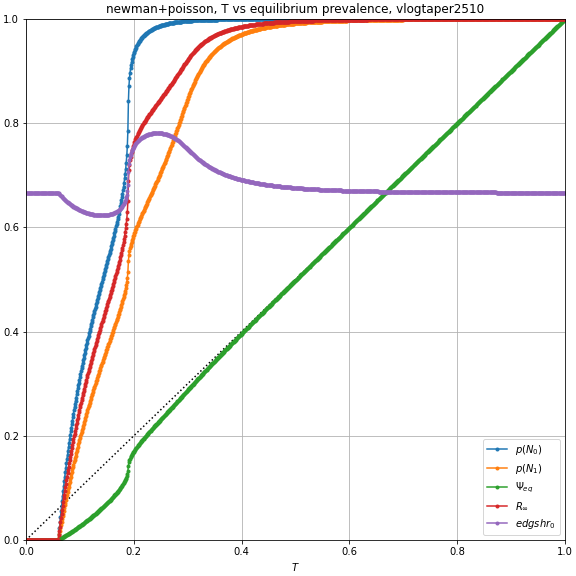
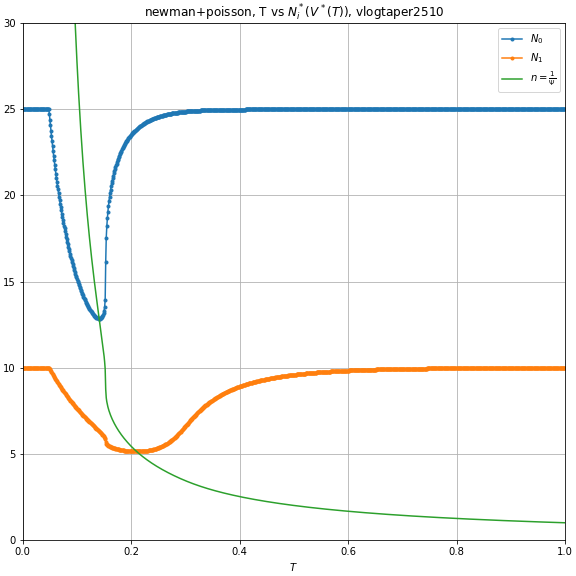
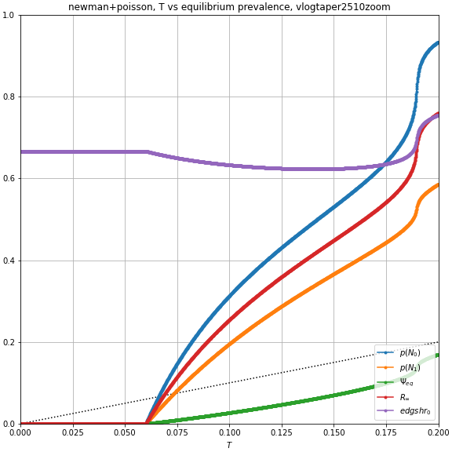
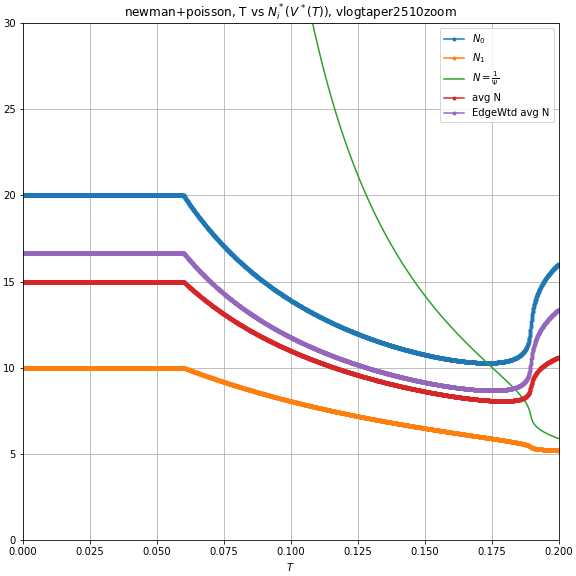
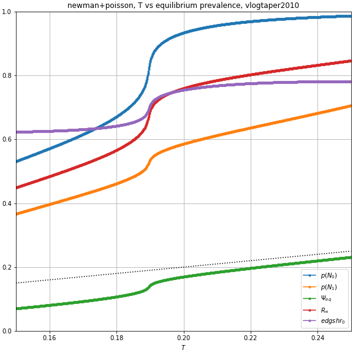
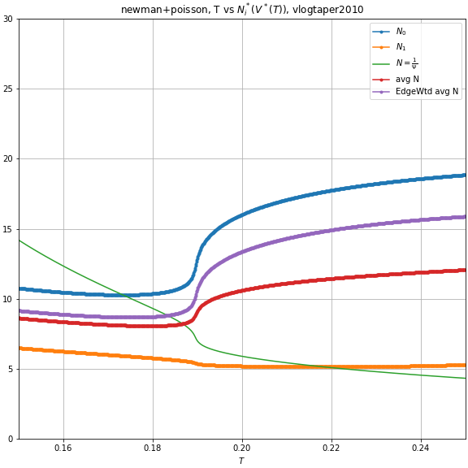
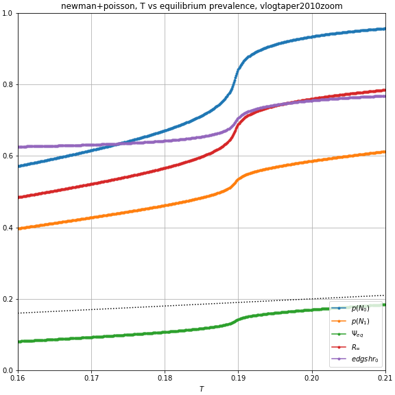
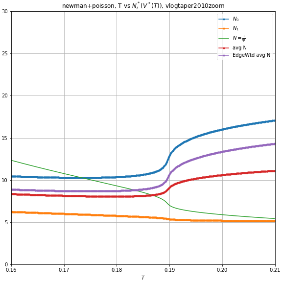

Problem
: The discontinuities were leading to an unpredictably lack of equilibrium.

Potential solution
: Each person chooses a desired number of contacts $$N$$, but their actual number of contacts is then determined via Poisson process with rate $$N$$.

## Contagion Risk to individual

- Var $$T$$ is transmissibility of the contagion. Assume $$T$$ the same for all connections.
- Var $$U$$ is the chance that absent your connection with a random neighbor, that neighbor would not get sick.
- The chance that the contagion is transmitted to you from any particular neighbor is $$(1-U)T$$.
    -  Var $$\Psi \equiv (1-U)T$$, var $$V\equiv 1-\Psi$$.
-  If you happen to have precisely $$k$$ neighbors, then the chance that none of your neighbors transmits to you is $$\left[1-\Psi\right]^{k}=V^k$$, and the chance *at least* one transmits to you is $$1-V^k$$
-  Given that you choose $$N$$ as your desired number of connections, the chance you have precisely $$k$$ actual connections is $$ e^{-N}\frac{N^k}{k!}$$ (from the PMF for a poisson distribution.)
-  Therefore your chance of getting sick, given choice of mean connections $$N$$ is $$p(N)= 1-e^{-\Psi N}$$

    $$p(N) \equiv \sum_{k=0}^\infty \left[ e^{-N}\frac{N^k}{k!} (1-V^k) \right] 
    = e^{-N} \sum_{k=0}^\infty \frac{N^k}{k!} - e^{-N} \sum_{k=0}^\infty \frac{(VN)^k}{k!} \\
    = e^{-N} e^N - e^{-N}e^{VN} = 1-e^{-(1-V)N}$$

- Marginal infection risk is $$\frac{d}{dN}p(N)=\Psi e^{-\Psi n}$$
- As an infection becomes more transmissive or prevalent, the marginal infection risk of any given $$N$$ can either go up or down: $$\frac{d}{d\Psi}\frac{d}{dN}p(N)=(1-\Psi n) e^{-\Psi n}$$.
    - This flips negative when $$n > \frac{1}{\Psi}$$. Past this threshold, a marginal increase in per-contact infection risk actually *decreases* the marginal infection risk from contacts.
    - This threshold occurs when $$P(N;\Psi) = 1 - \frac{1}{e} \approx 63.2\%$$.

## Contagion Spread, Singular Type chooses $$N$$

- PGF for connections: $$G_0(X)=\sum_{k=0}^\infty p_k x^k = \sum_{k=0}^\infty \frac{N^k e^{-N}}{k!} x^k = e^{(x-1)N}$$
- PGF for excess degree: $$G_1(x)=\frac{G'_0(x)}{G'_0(1)}=\frac{Ne^{(x-1)N}}{N} = e^{(x-1)N}$$
- PGF for transmissible connections: $$G_0(x;T)=G_0(1-T+TX)=e^{(x-1)TN}$$
- PGF for number of neighbor's transmissible excess edges: $$G_1(x;T)=G_1(1-T+Tx)=e^{(x-1)TN}$$
    - Note that based on the PGF, this is also a Poisson process with rate $$TN$$
- Critical Transmisiibility threshold $$T_c = \frac{1}{G'_1(1)} = \frac{1}{N}$$
- Chance that end of random edge remains uninfected determined implicitly by $$U=G_1(U;T)=e^{(U-1)TN}$$
    - No disease $$U=1$$ is always a solution, and is the only solution if $$T < T_c$$.
    - Full infection $$U=0$$ is only a solution if $$TN\to\infty$$, (though it can get remarkably close to 0 pretty fast, to within 4 decimal places at $$TN=16$$)
    - Otherwise if $$T > T_c$$, there exists a unique solution $$U\in(0,1)$$
- Rewriting in terms of $$V=1-T+TU$$, the chance that a given neighbor doesn't infect you is defined implicitly by $$V=(1-T)+Te^{(V-1)N}$$
- Rewriting in terms of $$\Psi$$, the risk of transmission from a given neighbor is defined implicitly by $$\Psi=T-Te^{-\Psi N} = T p(N)$$
- Ultimate prevalence: $$R_\infty = 1-G_0(U;T) = 1-e^{(U-1)TN} = 1-e^{-\Psi N} = p(N)$$

<!--Intersting how singular poisson distribution vanishes the difference between outbreak and spread, despite still being discrete in nature.-->

<!--But how do I justify this construct? Eh, that's a problem for later. Don't worry about it, present me.-->

<!--Can I have induce a continuum of types such that the distribution of $$TN_i$$ is gamma, and the distribution of offspring is negative binomial? Then compare the interventions in Schreiber to the mitigated or amplified effects of interventions with this structure of disease spread?-->

<!--As in basic poisson case, half-life for health is $$+\frac{-\ln(1/2)}{\Psi}\approx+\frac{0.69}{\Psi}. So eg if $$\Psi$$ is about 0.69, then each +1 connection will cut chance of remaining healthy in half.-->

## Contagion Spread, Multiple Types choose $$\{N_i\}$$

- PGF for connections: $$G_0(X)=\sum_{k=0}^\infty p_k x^k = \sum_i [A_i \sum_{k=0}^\infty \frac{N_i^k e^{-N_i} x^k}{k!}] = \sum_i [ A_i e^{(x-1)N_i}]$$
- PGF for excess degree: $$G_1(x)=\frac{G'_0(x)}{G'_0(1)}=\frac{\sum_i A_i N_i e^{(x-1)N_i}}{\sum_i A_i N_i}$$
- PGF for transmissible connections: $$G_0(x;T)=G_0(1-T+TX)=\sum_i A_i e^{(x-1) T N_i}$$
- PGF for number of neighbor's transmissible excess edges: $$G_1(x;T)=G_1(1-T+Tx)=\frac{\sum_i A_i N_i e^{(x-1)TN_i}}{\sum_i A_i N_i}$$
- Critical Transmisibility threshold $$T_c = \frac{1}{G'_1(1)} = \frac{\sum_i A_i N_i}{\sum_i A_i N_i^2} = \frac{E[N]}{E[N^2]}$$
- Chance that end of random edge remains uninfected determined implicitly by $$U=G_1(U;T)=\frac{\sum_i A_i N_i e^{(U-1)TN_i}}{\sum_i A_i N_i}$$
    - No disease $$U=1$$ is always a solution, and is the only solution if $$T < T_c$$.
    - Full infection $$U=0$$ is only a solution as $$TN_i\to\infty$$ for all $$i$$ such that $$A_i N_i\neq 0$$.
    - Otherwise if $$T > T_c$$, there exists a unique solution $$U\in(0,1)$$
- Rewriting in terms of $$V=1-T+TU$$, the chance that a given neighbor doesn't infect you is defined implicitly by $$V = (1-T) + T \frac{\sum_i A_i N_i e^{(V-1) N_i}}{\sum_i A_i N_i}$$.
    - Can also be written as $$1-V = T \frac{\sum_i A_i N_i (1-e^{-(1-V)N_i})}{\sum_i A_i N_i}$$
- Rewriting in terms of $$\Psi$$, the risk of transmission from a given neighbor is defined implicitly by $$\Psi = T - T \frac{\sum_i A_i N_i e^{-\Psi N_i}}{\sum_i A_i N_i}$$
- Ultimate prevalence: $$R_\infty = 1-G_0(U;T) = 1-\sum_i A_i e^{(U-1) T N_i} = 1-\sum_i A_i e^{-\Psi N_i} = \sum_i A_i [1-e^{-\Psi N_i}] = \sum_i A_i p(N_i)$$. Makes sense, yes.

## Equilibrium, multiple types.

Given $$T,\{A_i\}$$, equilibrium consists of $$\{N_i\},V$$ such that:

- Each person is myopically optimizing, taking $$V$$ as given and choosing $$N_I$$ such that:

    $$N_i = \argmax_{N_i} \left[  u_i(N_i) - \delta_i p(N_i)  \right]
    = \argmax_{N_i} \left[  u_i(N_i) - \delta_i + \delta_i e^{-(1-V)N}  \right]$$

- The per-contact disease risk is consistent with the decisions of individuals:

    $$V = (1-T) + T \frac{\sum_i A_i N_i e^{(V-1) N_i}}{\sum_i A_i N_i}$$

## Examples

### Example 1:

*NOTE: Different choices of parameters can lead to non-continous $$N^*_i(V)$$.*

Let $$u_H(n) = \frac{1}{2}[\ln(n) - \frac{1}{1250} x^2]$$
and let $$u_L(n) = \frac{1}{2}[\ln(n) - \frac{1}{200} x^2]$$.

Additionally, let $$A_H=A_L=0.5$$.

<!--second parameter 1/(2*X^2) where X is the optimum to be without risk-->

These utility functions were chosen so that
- the first few connections have very high marginal utility, 
- but eventually the utility from connections tapers off and starts decreasing.
- The response to disease risk is large enough to be noticeable.

_logtaper.png)

*Notice how both types start becoming increasingly fatalistic after crossing the threshold $$n=\frac{1}{1-V}$$.*

Each value of $$\Psi$$ gives a unique(?) pair of $$N_H^*,N_L^*$$,
and these connection parameters in term induce a contagion network in which
the danger from each connection is uniquely $$\Psi(N_H^*,N_L^*)$$ (or 0).
This is an equilibrium if $$\Psi=\Psi(N_H^*,N_L^*)$$

)_vlogtaper2510.png)

*It also seems clear when zooming in that there are no values of T that give multiple equilibria for this particular setup.*

<table><tr>
<td></td>
<td></td>
</tr><tr>
<td></td>
<td></td>
</tr></table>

*Here you can see that after T hits about 0.153, the H type becomes increasingly fatalistic, accelerating the increase in $$\Psi$$, which makes the not-yet-fatalistic type L reduce the number of their connections, concentrating connections among the H types, further increasing $$\Psi$$. This little feedback loop drives a temporary wedge between types, and rapidly acceralated the severity of the disease with only a small increase in actual transmissiveness.*

More generally, $$V(\{N_i\})$$ is continuous, so if each $$N_i^*(V)$$ is continuous, then an equilibrium must exist.
For multiple equilibria when $$N_i^*$$ are continuous, it needs to be that 
- There is some $$\Psi$$ such that 
    - It's an equilibrium for this society: $$\Psi(N(\Psi))=\Psi$$. 
    - At the margins, as $$\Psi$$ increases, $$\Psi'(N(\Psi)) > 1$$. That is, the behavior of people needs to be increasingly risky, so much so that it increases the equilibrium risk like a total bunch, man. Very high negative elasticity.

### Example 1.5

Same as previous, but now type $H$ has baseline desire for 20 connections instead of 25.

<table><tr>
<td></td>
<td></td>
</tr><tr>
<td></td>
<td></td>
</tr></table>

# TODO Tomorrow:

- [x] Make the scripts and plots for this setup.
- [ ] Make a plot for T vs $$\Psi_{eq}$$ for this util fucntion.
- [ ] $$R_0$$ for this setup?
- [ ] Double check that I calculated $$T_c$$ correctly.
- [ ] Plot marginal risk for this and others.
- [ ] Try to find a utility function with a nice analytic description for the relationship between some parameter and $$N_i^*(\Psi)$$, such that I can choose a distribution for this parameter that induces a gamma distribution on $$N_i^*$$ 
<!--Could maybe induce a distribution on offspring via a distribution on \delta_i. Different types of people are -->
- [ ] Something something elasticity?
    - [ ] How much does a proportional increase from each type increase the total risk?
    - [ ] Like the inverse of the half life concept?

