Problem
: The discontinuities were leading to an unpredictably lack of equilibrium.

Potential solution
: Each person chooses a desired number of contacts $$N$$, but their actual number of contacts is then determined via Poisson process with rate $$N$$.

## Contagion Risk to individual

- Var $$T$$ is transmissibility of the contagion. Assume $$T$$ the same for all connections.
- Var $$U$$ is the chance that absent your connection with a random neighbor, that neighbor would not get sick.
- The chance that the contagion is transmitted to you from any particular neighbor is $$(1-U)T$$.
    -  Var $$\Psi \equiv (1-U)T$$, var $$V\equiv 1-\Psi$$.
-  If you happen to have precisely $$k$$ neighbors, then the chance that none of your neighbors transmits to you is $$\left[1-\Psi\right]^{k}=V^k$$, and the chance *at least* one transmits to you is $$1-V^k$$
-  Given that you choose $$N$$ as your desired number of connections, the chance you have precisely $$k$$ actual connections is $$ e^{-N}\frac{N^k}{k!}$$ (from the PMF for a poisson distribution.)
-  Therefore your chance of getting sick, given choice of mean connections $$N$$ is $$p(N)= 1-e^{-\Psi N}$$

    $$p(N) \equiv \sum_{k=0}^\infty \left[ e^{-N}\frac{N^k}{k!} (1-V^k) \right] 
    = e^{-N} \sum_{k=0}^\infty \frac{N^k}{k!} - e^{-N} \sum_{k=0}^\infty \frac{(VN)^k}{k!} \\
    = e^{-N} e^N - e^{-N}e^{VN} = 1-e^{-(1-V)N}$$

- Marginal infection risk is $$\frac{d}{dN}p(N)=\Psi e^{-\Psi n}$$
- As an infection becomes more transmissive or prevalent, the marginal infection risk of any given $$N$$ can either go up or down: $$\frac{d}{d\Psi}\frac{d}{dN}p(N)=(1-\Psi n) e^{-\Psi n}$$.
    - This flips negative when $$n > \frac{1}{\Psi}$$. Past this threshold, a marginal increase in per-contact infection risk actually *decreases* the marginal infection risk from contacts.
    - This threshold occurs when $$P(N;\Psi) = 1 - \frac{1}{e} \approx 63.2\%$$.

## Contagion Spread, Singular Type chooses $$N$$

- PGF for connections: $$G_0(X)=\sum_{k=0}^\infty p_k x^k = \sum_{k=0}^\infty \frac{N^k e^{-N}}{k!} x^k = e^{(x-1)N}$$
- PGF for excess degree: $$G_1(x)=\frac{G'_0(x)}{G'_0(1)}=\frac{Ne^{(x-1)N}}{N} = e^{(x-1)N}$$
- PGF for transmissible connections: $$G_0(x;T)=G_0(1-T+TX)=e^{(x-1)TN}$$
- PGF for number of neighbor's transmissible excess edges: $$G_1(x;T)=G_1(1-T+Tx)=e^{(x-1)TN}$$
    - Note that based on the PGF, this is also a Poisson process with rate $$TN$$
- Critical Transmisiibility threshold $$T_c = \frac{1}{G'_1(1)} = \frac{1}{N}$$
- Chance that end of random edge remains uninfected determined implicitly by $$U=G_1(U;T)=e^{(U-1)TN}$$
    - No disease $$U=1$$ is always a solution, and is the only solution if $$T < T_c$$.
    - Full infection $$U=0$$ is only a solution if $$TN\to\infty$$, (though it can get remarkably close to 0 pretty fast, to within 4 decimal places at $$TN=16$$)
    - Otherwise if $$T > T_c$$, there exists a unique solution $$U\in(0,1)$$
- Rewriting in terms of $$V=1-T+TU$$, the chance that a given neighbor doesn't infect you is defined implicitly by $$V=(1-T)+Te^{(V-1)N}$$
- Rewriting in terms of $$\Psi$$, the risk of transmission from a given neighbor is defined implicitly by $$\Psi=T-Te^{-\Psi N} = T p(N)$$
    - Note $$\frac{d\Psi}{dN}=T e^{-\Psi N}\cdot [N\frac{d\Psi}{dN} + \Psi]$$ so $$\frac{d\Psi}{dN}=\frac{T \Psi e^{-\Psi N}}{1- T N e^{-\Psi N}}$$.
    - Thus an increase in $$N$$ decreases the risk that a random neighbor will transmit to you if $$T N e^{-\Psi N} > 1$$.
    - Of course, this can't happen in the singular type case. (PROOF?)
- Ultimate prevalence: $$R_\infty = 1-G_0(U;T) = 1-e^{(U-1)TN} = 1-e^{-\Psi N} = p(N)$$
- According to Newman et al (2005), the **standard SIR model** is functionally equivalent to the case where the the degree distribution is Poisson. (That is, this case.)

<!--Intersting how singular poisson distribution vanishes the difference between outbreak and spread, despite still being discrete in nature.-->

<!--But how do I justify this construct? Eh, that's a problem for later. Don't worry about it, present me.-->

<!--Can I have induce a continuum of types such that the distribution of $$TN_i$$ is gamma, and the distribution of offspring is negative binomial? Then compare the interventions in Schreiber to the mitigated or amplified effects of interventions with this structure of disease spread?-->

<!--As in basic poisson case, half-life for health is $$+\frac{-\ln(1/2)}{\Psi}\approx+\frac{0.69}{\Psi}. So eg if $$\Psi$$ is about 0.69, then each +1 connection will cut chance of remaining healthy in half.-->

## Contagion Spread, Multiple Types choose $$\{N_i\}$$

- PGF for connections: $$G_0(X)=\sum_{k=0}^\infty p_k x^k = \sum_i [A_i \sum_{k=0}^\infty \frac{N_i^k e^{-N_i} x^k}{k!}] = \sum_i [ A_i e^{(x-1)N_i}]$$
- PGF for excess degree: $$G_1(x)=\frac{G'_0(x)}{G'_0(1)}=\frac{\sum_i A_i N_i e^{(x-1)N_i}}{\sum_i A_i N_i}$$
- PGF for transmissible connections: $$G_0(x;T)=G_0(1-T+TX)=\sum_i A_i e^{(x-1) T N_i}$$
- PGF for number of neighbor's transmissible excess edges: $$G_1(x;T)=G_1(1-T+Tx)=\frac{\sum_i A_i N_i e^{(x-1)TN_i}}{\sum_i A_i N_i}$$
- Critical Transmisibility threshold $$T_c = \frac{1}{G'_1(1)} = \frac{\sum_i A_i N_i}{\sum_i A_i N_i^2} = \frac{E[N]}{E[N^2]}$$
    - Notice that in Newman, $$T_c = \frac{E[k]}{[E[k^2]-E[k]}$$. This matches the above because with this setup, $$E[N]=E[k]$$ and $$E[k^2]=E[N^2]+E[N]$$.
- Likewise, $$R_0 = \frac{T}{T_c} = T\cdot\frac{E[k^2]-E[k]}{E[k]} = T \frac{E[N^2]}{E[N]}$$
    - Note that $$G_1'(x;T)=T \frac{\sum_i A_i N_i^2 e^{(x-1)TN_i}}{\sum_i A_i N_i}$$ and $$G_1'(1;T)=T \frac{\sum_i A_i N_i^2 }{\sum_i A_i N_i} = R_0$$.
    - This is because $$G_1(x;t)$$ is the PGF for the distribution of additional infections a random neighbor causes after they themselves have been infected, and evaluating a PGF's derivative at $$1$$ gives you the mean of the distribution that PGF generates.
- Chance that end of random edge remains uninfected determined implicitly by $$U=G_1(U;T)=\frac{\sum_i A_i N_i e^{(U-1)TN_i}}{\sum_i A_i N_i}$$
    - No disease $$U=1$$ is always a solution, and is the only solution if $$T < T_c$$.
    - Full infection $$U=0$$ is only a solution as $$TN_i\to\infty$$ for all $$i$$ such that $$A_i N_i\neq 0$$.
    - Otherwise if $$T > T_c$$, there exists a unique solution $$U\in(0,1)$$
    - Notice that $$1-U=\frac{\sum_i A_i N_i}{\sum_i A_i N_i}-\frac{\sum_i A_i N_i e^{(U-1)TN_i}}{\sum_i A_i N_i} = \frac{\sum_i A_i N_i (1-e^{(U-1)TN_i)}}{\sum_i A_i N_i} = \frac{\sum_i A_i N_i p(N_i)}{\sum_i A_i N_i}$$. That is, $$1-U$$ is the chance a random neighbor gets sick at some point. 
        - This is a consequence of the Poisson connection assumption, similar to how Poisson games let a person ignore the information they have by virtue of knowing that they are a participant.
    - If $$T$$ goes up, then (the nonzero) $$U$$ must go down.  Holding the $$N_i$$ fixed, $$\frac{dU(T)}{dT} < 0$$ whenever a pandemic can occur.
        - This is because if we solve for the derivative $$\frac{dU}{dT}$$, we'll get a negative numerator and a denominator equal to $$1-T\frac{\sum_{i}A_{i}N_{i}^{2}e^{(U-1)TN_{i}}}{\sum_{i}A_{i}N_{i}}=\frac{d}{dU} [U-\frac{\sum_i A_i N_i e^{(U-1)TN_i}}{\sum_i A_i N_i}]$$. 
        - The pandemic solution for $$U(T)$$ is less than the value of $$U$$ which would set the denominator to zero, and thus the denominator at that point must be positive.
        - See [notes_newman_poisson_checkingPsiPrime](notes_newman_poisson_checkingPsiPrime.lyx) for details.
- Rewriting in terms of $$V=1-T+TU$$, the chance that a given neighbor doesn't infect you is defined implicitly by $$V = (1-T) + T \frac{\sum_i A_i N_i e^{(V-1) N_i}}{\sum_i A_i N_i}$$.
    - Can also be written as $$1-V = T \frac{\sum_i A_i N_i (1-e^{-(1-V)N_i})}{\sum_i A_i N_i}$$
- Rewriting in terms of $$\Psi$$, the risk of transmission from a given neighbor is defined implicitly by $$\Psi = T - T \frac{\sum_i A_i N_i e^{-\Psi N_i}}{\sum_i A_i N_i}$$
    - Can also be written $$\Psi = T \frac{\sum_i A_i N_i [1-e^{-\Psi N_i}]}{\sum_i A_i N_i}$$
    - Taking the derivative $$\frac{d}{d\Psi}$$ and evaluating at $$\Psi=0$$ yeilds $$R_0$$.
    - Note also that $$\frac{d\Psi}{dN_i} > 0$$ iff $$p(N_i) + N_i p'(N_i) > \frac{\Psi}{T} = (1-U)$$. 
        - But that $$p'(N_i)$$ term works out to $$e^{-\Psi N_i}[\Psi + N_i \frac{d\Psi}{dN_i}]$$, I'm pretty sure. Which makes things more complicated.
    - When outbreak is possible, increasing $$\frac{d\Psi}{dT} > 0$$ (see [lyx notes](notes_newman_poisson_checkingPsiPrime.lyx)).
- Ultimate prevalence: $$R_\infty = 1-G_0(U;T) = 1-\sum_i A_i e^{(U-1) T N_i} = 1-\sum_i A_i e^{-\Psi N_i} = \sum_i A_i [1-e^{-\Psi N_i}] = \sum_i A_i p(N_i)$$. Makes sense, yes.

Let $$p_i$$ be shorthand for $$1-e^{-\Psi N_i}$$ and $$\Psi'$$ be shorthand for $$\frac{d\Psi}{dN_j}$$ for some specific $$j$$.
Then 

$$\Psi' = T \frac{(A_jN_jp_j'+A_jp_j)(\sum_iA_iN_i)-(\sum_iA_iN_ip_i)A_j}{(\sum_iA_iN_i)^2}$$

Where in this context, $$p_j'=e^{-\Psi N_j}\cdot[N_j\Psi'+\Psi]$$. So

$$\Psi' = T \frac{(A_jN_je^{-\Psi N_j}N_j\Psi')(\sum_iA_iN_i)}{(\sum_iA_iN_i)^2}
+T\frac{(A_jN_je^{-\Psi N_j}\Psi+A_jp_j)(\sum_iA_iN_i)-(\sum_iA_iN_ip_i)A_j}{(\sum_iA_iN_i)^2}$$

$$\Psi' \cdot \left[1 - T \frac{(A_jN_j^2e^{-\Psi N_j})}{(\sum_iA_iN_i)}\right]= 
TA_j\frac{(N_je^{-\Psi N_j}\Psi+p_j)(\sum_iA_iN_i)-(\sum_iA_iN_ip_i)}{(\sum_iA_iN_i)^2}$$

$$\Psi' \cdot \left[1 - T \frac{(A_jN_j^2e^{-\Psi N_j})}{(\sum_iA_iN_i)}\right]= 
\frac{TA_j(\sum_iA_iN_i \left[\left(N_j \Psi-1\right)e^{-\Psi N_j} + e^{-\Psi N_i}\right])}{(\sum_iA_iN_i)^2}$$

$$\Psi' = \frac{\frac{TA_j(\sum_iA_iN_i \left[\left(N_j \Psi-1\right)e^{-\Psi N_j} + e^{-\Psi N_i}\right])}{(\sum_iA_iN_i)^2}}{1 - T \frac{(A_jN_j^2e^{-\Psi N_j})}{(\sum_iA_iN_i)}}$$

$$\Psi' = \frac{TA_j(\sum_iA_iN_i \left[\left(N_j \Psi-1\right)e^{-\Psi N_j} + e^{-\Psi N_i}\right])}{\mu_N^2 - \mu_N T A_jN_j^2 e^{-\Psi N_j}}$$

- The denominator is negative when $$T A_j N_j^2 e^{-\Psi N_j} > \mu_N$$.
    - Agrees with singular case up above.
- The numerator is positive when ...
    - If $$N > \frac{1}{\Psi}$$, then the numerator is surely positive.

Okay, this confuses me a bit. 
The term $$N_j^2 e^{-\Psi N_j}$$ maxes out at $$\frac{4}{e^2\Psi^2}\approx \frac{0.54}{\Psi^2}$$ when $$N_j=\frac{2}{\Psi}$$. 
At this $$N_j$$, if $$\mu$$ is relatively small, the numerator is positive while the denominator is negative.
So a high activity group can decrease edge risk by increasing their own activity at the margins???

That doesn't make sense.

Here's the derivative calculated a second time in LyX (`notes_newman_poisson_checkingPsiPrime.lyx`), using only two types, l and h:

$$\frac{\partial\Psi}{\partial N_{l}}=\frac{TA_{l}\cdot\left[e^{-\Psi N_{l}}\left[\frac{A_{l}N_{l}}{\mu}+N_{l}\Psi-1\right]+\frac{A_{h}N_{h}}{\mu}e^{-\Psi N_{h}}\right]}{\mu-\left[TA_{l}e^{-\Psi N_{l}}N_{l}^{2}\right]}$$

Looks like it matches up fine. Haven't checked the implications yet. Need to do that tomorrow.

# TODO: Do that tomorrow.

---

## Equilibrium, multiple types.

Given $$T,\{A_i\}$$, equilibrium consists of $$\{N_i\},V$$ such that:

- Each person is myopically optimizing, taking $$V$$ as given and choosing $$N_I$$ such that:

    $$N_i = \argmax_{N_i} \left[  u_i(N_i) - \delta_i p(N_i)  \right]
    = \argmax_{N_i} \left[  u_i(N_i) - \delta_i + \delta_i e^{-(1-V)N}  \right]$$

- The per-contact disease risk is consistent with the decisions of individuals:

    $$V = (1-T) + T \frac{\sum_i A_i N_i e^{(V-1) N_i}}{\sum_i A_i N_i}$$

---

## Examples

### Example 1:

*NOTE: Different choices of parameters can lead to non-continous $$N^*_i(V)$$.*

Let $$u_H(n) = \frac{1}{2}[\ln(n) - \frac{1}{1250} x^2]$$
and let $$u_L(n) = \frac{1}{2}[\ln(n) - \frac{1}{200} x^2]$$.

Additionally, let $$A_H=A_L=0.5$$.

<!--second parameter 1/(2*X^2) where X is the optimum to be without risk-->

These utility functions were chosen so that
- the first few connections have very high marginal utility, 
- but eventually the utility from connections tapers off and starts decreasing.
- The response to disease risk is large enough to be noticeable.

_logtaper.png)

*Notice how both types start becoming increasingly fatalistic after crossing the threshold $$n=\frac{1}{1-V}$$.*

Each value of $$\Psi$$ gives a unique(?) pair of $$N_H^*,N_L^*$$,
and these connection parameters in term induce a contagion network in which
the danger from each connection is uniquely $$\Psi(N_H^*,N_L^*)$$ (or 0).
This is an equilibrium if $$\Psi=\Psi(N_H^*,N_L^*)$$

)_vlogtaper2510.png)

*It also seems clear when zooming in that there are no values of T that give multiple equilibria for this particular setup.*

<table><tr>
<td></td>
<td>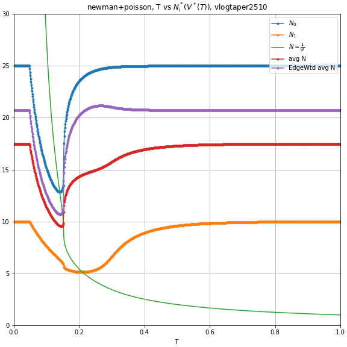</td>
</tr><tr>
<td>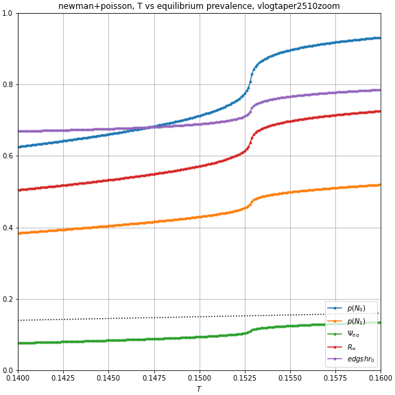</td>
<td>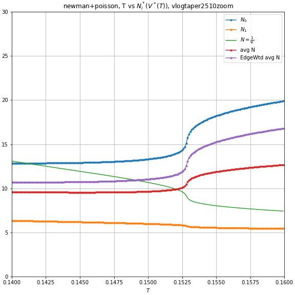</td>
</tr></table>

*Here you can see that after T hits about 0.153, the H type becomes increasingly fatalistic, accelerating the increase in $$\Psi$$, which makes the not-yet-fatalistic type L reduce the number of their connections, concentrating connections among the H types, further increasing $$\Psi$$. This little feedback loop drives a temporary wedge between types, and rapidly acceralated the severity of the disease with only a small increase in actual transmissiveness.*

More generally, $$V(\{N_i\})$$ is continuous, so if each $$N_i^*(V)$$ is continuous, then an equilibrium must exist.
For multiple equilibria when $$N_i^*$$ are continuous, it needs to be that 
- There is some $$\Psi$$ such that 
    - It's an equilibrium for this society: $$\Psi(N(\Psi))=\Psi$$. 
    - At the margins, as $$\Psi$$ increases, $$\Psi'(N(\Psi)) > 1$$. That is, the behavior of people needs to be increasingly risky, so much so that it increases the equilibrium risk like a total bunch, man. Very high negative elasticity.

### Example 1.1

Same as previous, but now type $H$ has baseline desire for 20 connections instead of 25.

<table><tr>
<td></td>
<td>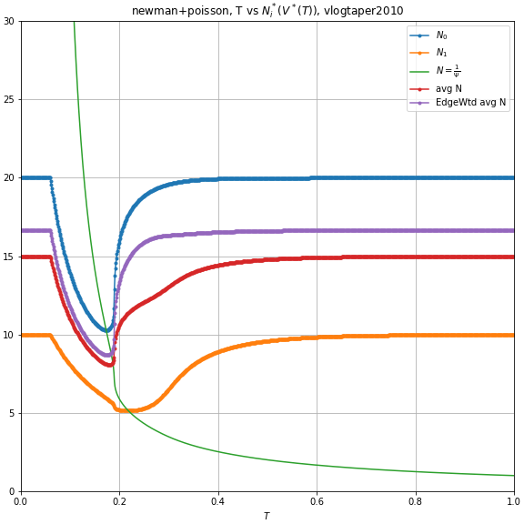</td>
</tr><tr>
<td></td>
<td></td>
</tr></table>

### Example 1.2

Same as previous, but now type $H$ has baseline desire for 30 connections instead of 25.

<table><tr>
<td>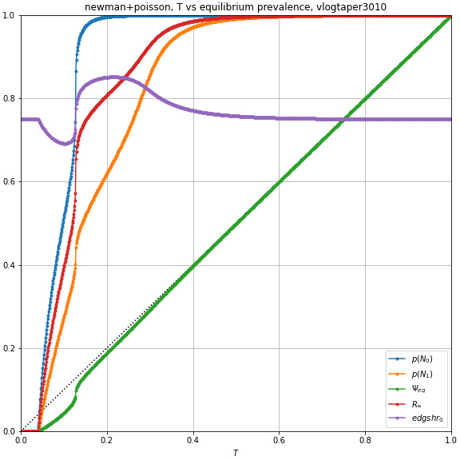</td>
<td>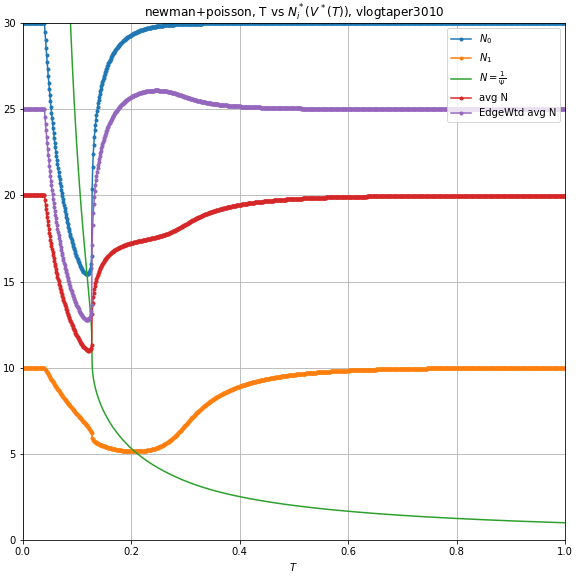</td>
</tr><tr>
<td>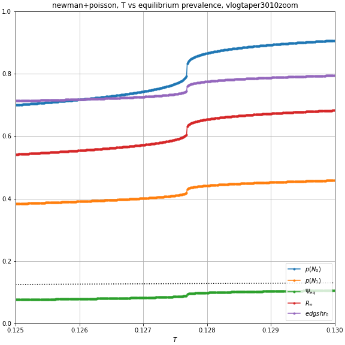</td>
<td>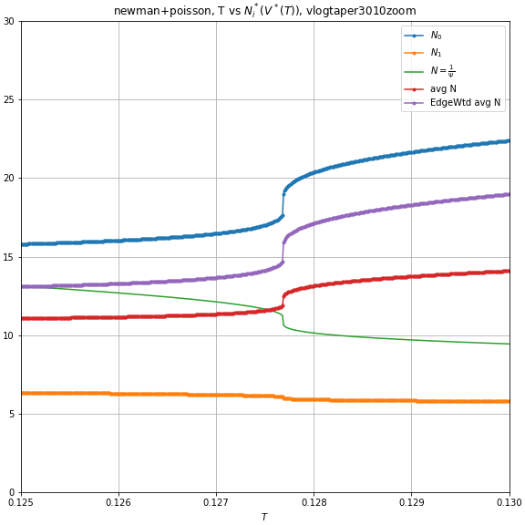</td>
</tr></table>

*Wait, is there actually a discontinuity in this one???*

<table><tr>
<td>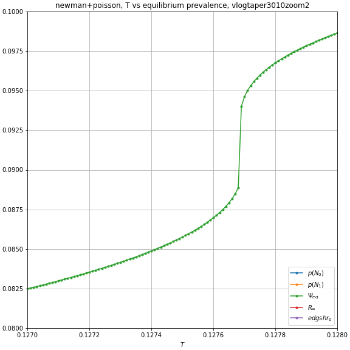</td>
<td>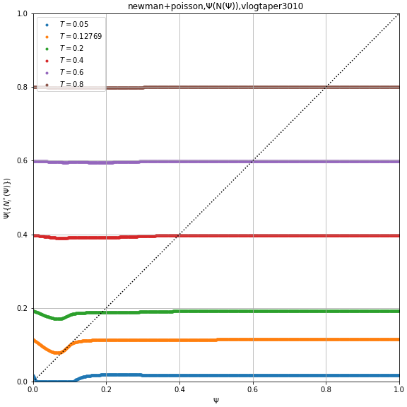</td>
</tr></table>
<table><tr>
<td>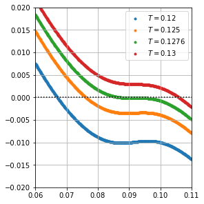</td>
<td></td>
</tr></table>

*Yes, indeed, there does appear to be multiple equilbria at $$T=0.12769$$. This causes the gaph of equilibrium $\Psi(T)$, to jump a bit as $$T$$ passes this point. It could be a computer approximation mistake., but I only went to 5 decimal places, which I think is witihin the accuracy of the numerical solvers.*

### Example 1.3

Same as previous, but now type $H$ has baseline desire for 50 connections instead of 25.

<table><tr>
<td>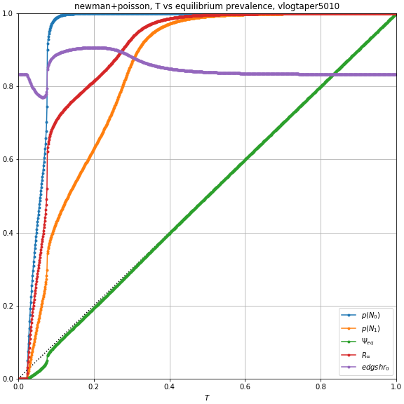</td>
<td>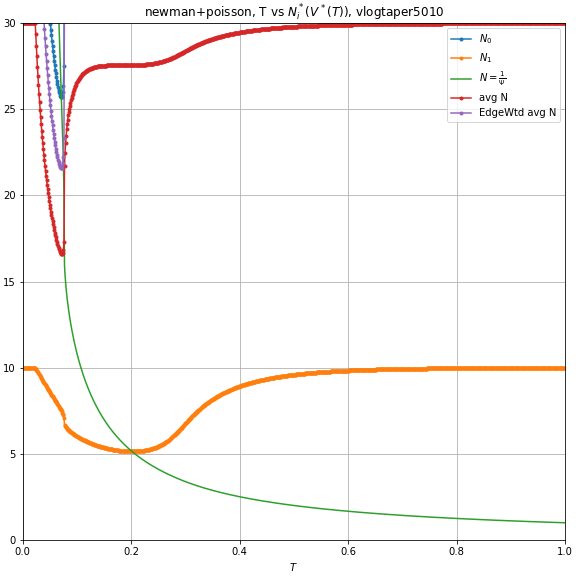</td>
</tr><tr>
<td>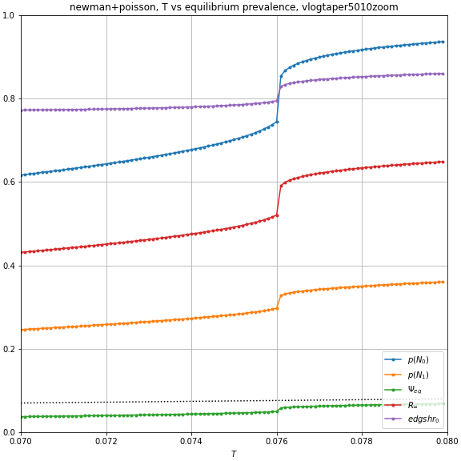</td>
<td>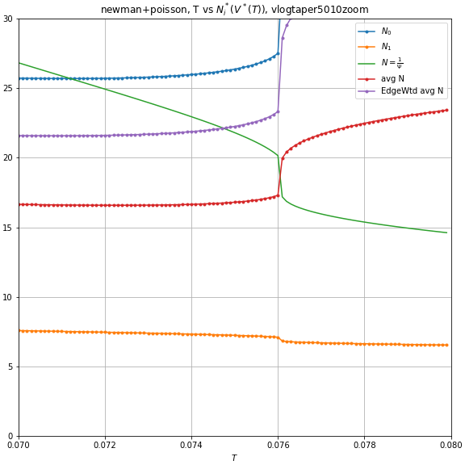</td>
</tr><tr>
<td>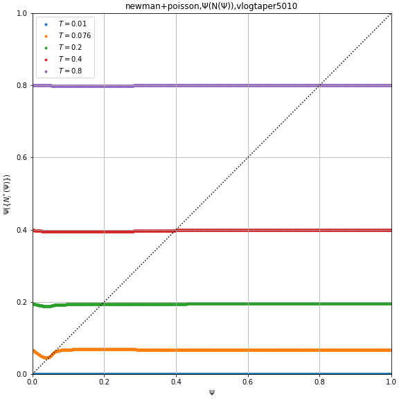</td>
<td>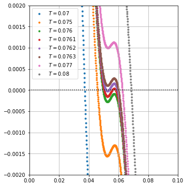</td>
</tr></table>

*The multiple equilibria are even more apparent in this one. (Order of magnitude is less extreme). A change in T of 0.0003 causes equilbrium $$\Psi$$ to jump from about 5% to 6%, which is enough to induce noticeable behavioral changes.*

*To clarify, I was correct that an equilibrium always exists in this setup.*
*I was incorrect in my conjecture that with these utility functions, there would only be one equilibrium.*

### Example 1.4

Same as example 1, but varying the percent of the population which is of type H.

Left: 90% is type H; Mid: 10%; right: 05%.

<table><tr>
<td>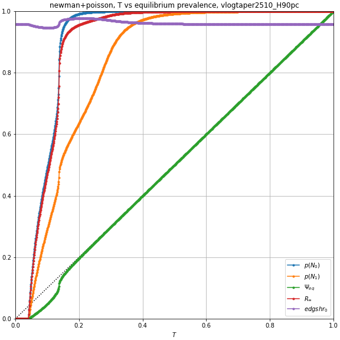</td>
<td>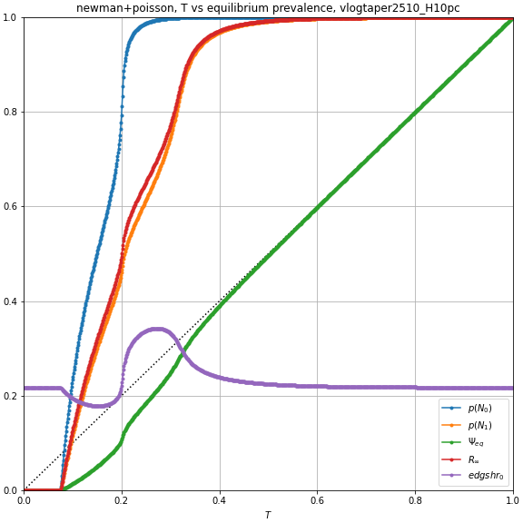</td>
<td></td>
</tr><tr>
<td>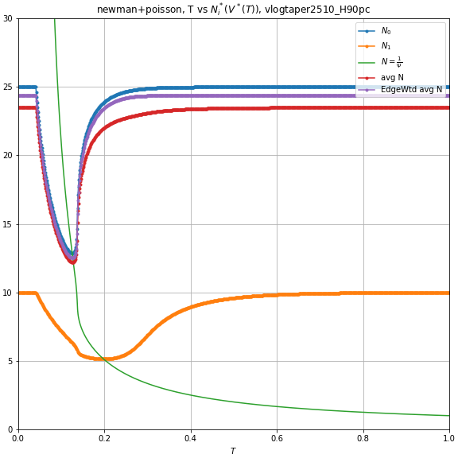</td>
<td>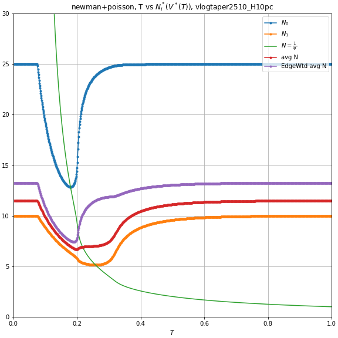</td>
<td>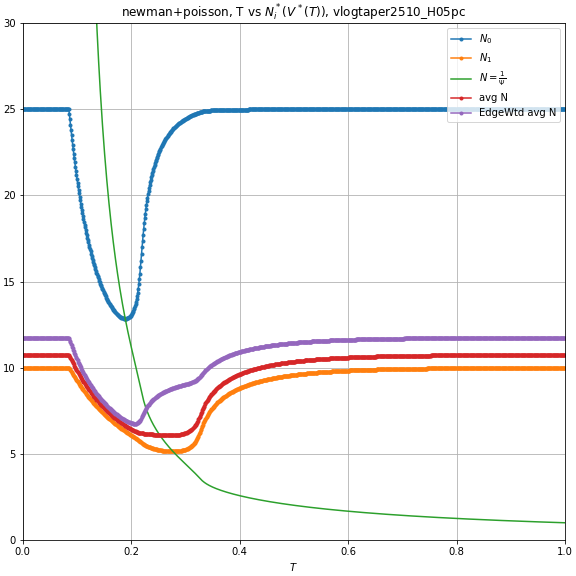</td>
</tr></table>

## Example 2: Negbinom distribution, proportional response

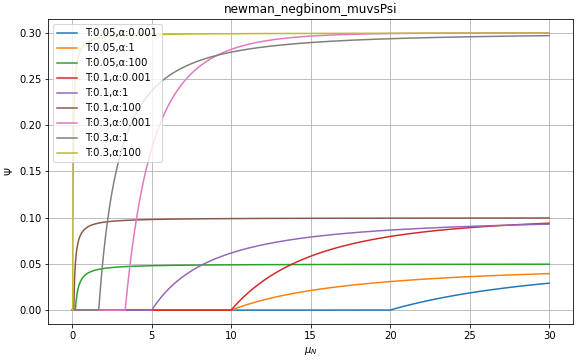

*Here, $$k=\frac{1}{\alpha}$$ is the dispersion, while $$\mu$$ is the mean of the degree distribution. It so happens that this leads to an offspring distribution for the contagion where the mean is $$\mu \frac{k+1}{k} T$$ and the dispersion is $$k+1$$*

)_proportionalresponse.png)

*Here we can see how a linearly proportional response doesn't lead to much interesting happening in terms of fatalism*

)_propresponse_expdecy.png)

*Here's something similar where everyone's connections scale proportionally, but the mean connections are $$30e^{-10x}$$. Still no fatalism but at least there is something a bit more interesting to look at.*

(Remember that very low $$\alpha$$ means very high $$k$$ means distribution is approximately Poisson.)

If $$\mu_n^*(\Psi)$$ is decreasing, then multiple equilibria cannot exist.

)_propresponse_increasing.png)
*Here, where the mean connection actually is just $$\mu_N=30\cdot\Psi$$, there is either the unique equilibria at $$\Psi=0$$, or multiple equilibria.*

# TODO Tomorrow:

- [ ] Double check the calculations for $$\Psi'$$ up above. I'm getting the implication that a high actiivty group can reduce edge risk by increasing their own activity. Doesn't make much sense.
- [x] Make plots for the negbinom distribution, where k is held constant.
    - [ ] Try various functions for $$\mu(\Psi)$$. See if I can figure out when multiple equilibria become possible.
- [ ] Plug in some reasonable parameters for the negexp utility and just make some plots.
    - [ ] Start with just a couple types.
    - [ ] Use the induced distribution from [7-01 D] with a gamma distributed $$N_i$$
        - [ ] Make plots of mean connection and E squared connection.  
- [ ] Go back and take a second look at the weird note at the end of the altutil notes
- [ ] Write some general theorem about utility and uniqueness etc. If u'' < c'', etc.
- [ ] Start structuring the actual paper.

Interesting questions to ask and answer: 
- Can  a reduction in $$T$$ (masking) increase $$R_\infty$$? 
    - Under what circumstances?
    - Specifically under what circumstances in the simple proportional negbinom case?
- Can vaccines increase the prevalence of the disease? What about specifically among the unvaccinated?
- Can adding a fixed cost to social connections increase $$\Psi$$? 
    - What about $$R_\infty$$?
    - If no to either, what about just increasing the index of dispersion?

- [ ] Plot marginal risk for this and others.
- [ ] Try to find a utility function with a nice analytic description for the relationship between some parameter and $$N_i^*(\Psi)$$, such that I can choose a distribution for this parameter that induces a gamma distribution on $$N_i^*$$ 
<!--Could maybe induce a distribution on offspring via a distribution on \delta_i. Different types of people are -->
- [ ] Something something elasticity?
    - [ ] How much does a proportional increase from each type increase the total risk?
    - [ ] Like the inverse of the half life concept?
- [ ] Look at performance of iterative approach as in CNSW 2000? Start with initial guess for V and just plug it a bunch of times?
- [ ] Verify that the single type case behaves like a standard SIR model.
- [ ] Figure out how the $$T_c$$ changes in an "coorelated network" (see Newman 05,p74, lower right)
- [ ] Impose bond *and* site percolation to simulate vaccines?
- [ ] Can I do anything with those notes I took in lyx and on 6-28? Maybe plot $$\Psi$$ vs $$1-e^{-\Psi N^*(\Psi)}$$?? Or is it just useless? 
    - [ ] Actaully, yeah, rexpress those notes in terms of elasticity, and that might be exactly the sort of theorem that David is looking for. 

