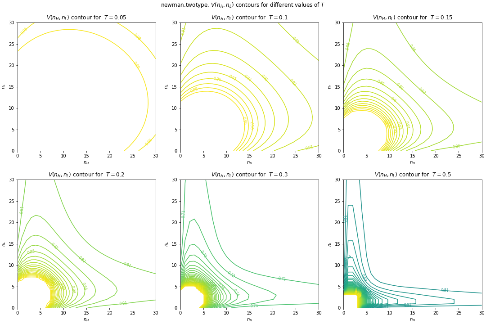
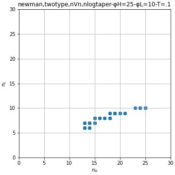

## Contagion Risk to individual

This section is nearly the same as for the one-type case because the individual's problem can be written purely in terms of a statistic about the expected risk of a random connection.

- Var $$T$$ is transmissibility of the contagion. Assume $$T$$ the same for all connections.
- Var $$U$$ is the chance that absent your connection with a random neighbor, that neighbor would not get sick.
- The chance that the contagion is transmitted to you from any particular neighbor is $$(1-U)T$$.
    -  Var $$\Psi \equiv (1-U)T$$, var $$V\equiv 1-\Psi$$.
- The chance that none of your neighbors transmits to you is $$\left[1-\Psi\right]^{n}=V^n$$.
- The chance that *at least* one neighbor transmits to you is $$p(n) = 1-\left[1-\Psi \right]^{n}$$.

Now suppose the individual takes $$U$$ for granted, and wants to go about myopically choosing $$n$$.

- The risk of getting sick is increasing in $$n$$, and the marginal increase in disease risk in going from $$n-1$$ connections to $$n$$ connections is 
        
    $$p(n) - p(n-1) = \left(1 - \left[1-\Psi\right]^{n}\right) - \left(1 - \left[1-\Psi\right]^{n-1}\right) \\
    = [1-\Psi]^{n-1} - [1-\Psi]^{n} \\
    =[1-\Psi]^{n-1}\Psi > 0$$

- For any given $$n$$, as $$\Psi$$ increases, (increasing transmissibility or final prevalence), the marginal disease risk can either increase *or* decrease.
  
    $$\frac{d}{d\Psi}[p(n) - p(n-1)]  
    = -(n-1)[1-\Psi]^{n-2} + n[1-\Psi]^{n-1} \\
    = [1-\Psi]^{n-2}[-(n-1) + n[1-\Psi]] \\
    = [1-\Psi]^{n-2}[1-n\Psi]$$

- iff $$n > 1/\Psi = 1/(1-V)$$, then the marginal disease risk from your $$nth$$ connection actually *decreases* as each individual contact becomes more dangerous. 
- This threshold occurs at different values of $$p(n)$$ depending on the the value of $$\Psi$$, but is bounded above by $$p(\frac{1}{\Psi}) < \frac{1}{e} \approx 37\%$$.

*(If you do the same thing but with continuous n to get $${d\over dn} {d\over d\Psi} p(n)$$, then the threshold is instead $$n>-\frac{1}{\ln (1-\Psi)}$$. The difference between the two thresholds is 1 at $$\Psi=1$$ and $$1\over2$$ at $$Psi=0$$. Not that this matter bc I don't think this is a sensible continuous extension of the problem.)*

## Individual decision about contacts

- Var $$\delta$$ is the cost incurred by illness
- Aside from contagion, person recieves some utility $$u(n)$$ from contacts.
- Preferences are represented by $$U(n)=u(n)-\delta p(n)$$
- Myopic individual, taking $$\Psi$$ as given, chooses $$n\in\Z_+$$ to solve

    $$\max_n [u(n)-\delta p(n)] = \max_n [u(n) - \delta (1-[1-\Psi]^n)]$$

<!--maximimum connection number a la Kremer?-->    

## Contagion spread, two types. Each type has a singular degree distribution.

Suppose there are two types of agents, indexed by $$i$$.
Type $$i$$ comprises portion $$A_i$$ of the population, with $$\sum_i A_i = 1$$.
Every agent of type $$i$$ is identical and chooses $$n_i$$ connections. 
The degree distribution is described by $$p_i=A_i$$.

- Var $$T$$ is still assumed to be the same for all connections.

Following Newman, look at the the probability generating functions for the spread of this disease.

<!--A_H x^{n_H} + A_L x^{n_L}-->

- PGF for number of neighbors: $$G_0(x)=\sum_k p_k x^k = \sum_i A_i x^{n_i}$$
- PGF for excess degree of random neighbor: $$G_1(x)=\frac{G'_0(x)}{\mu}=\frac{\sum_i A_i n_i x^{n_i-1}}{\sum_i A_i n_i}$$
- PGF for number of transmissible connections: $$G_0(x;T)=G_0(1-T+TX)=\sum_i A_i (1-T+Tx)^{n_i}$$
- PGF for number of neighbor's transmissible excess edges: $$G_1(x;T)=G_1(1-T+Tx)=\frac{\sum_i A_i n_i (1-T+Tx)^{n_i-1}}{\sum_i A_i n_i}$$
- Critical Transmisiibility threshold $$T_c = \frac{1}{G'_1(1)} = \frac{\sum_i A_i n_i}{\sum_i A_i n_i (n_i-1)} = \frac{E[n]}{E[n^2] - E[n]}$$
    
    
- (Meyers Newman et al 2004) $$R_0 = T(\frac{E[k^2]}{E[k]}-1) = T(\frac{\sum_i A_i n_i^2}{\sum_i A_i n_i} - 1) = T\frac{\sum_i A_i n_i (n_i-1)}{\sum_i A_i n_i}$$
- Chance that end of random edge remains uninfected determined implicitly by $$U=\frac{\sum_i A_i n_i (1-T+TU)^{n_i-1}}{\sum_i A_i n_i}$$
    - No disease $$U=1$$ is always a solution, 
        - and is the only solution if $$T < T_c$$ <!--because of concavity-->
    - Full infection $$U=0$$ is only a solution if $$T=1$$.
    - Otherwise if $$T > T_c$$, there exists a unique solution $$U\in(0,1)$$
- Rewriting in terms of $$V=1-T+TU$$, the chance that a given neighbor doesn't infect you is defined implicitly by 

    $$V=1-T+T\frac{\sum_i A_i n_i V^{n_i-1}}{\sum_i A_i n_i}$$

    - When $$T > T_c$$, just as U has a unique solution in (0,1), V has a unique solution in (1-T,1).
    - This can be rearranged to get a polynomial which has a unique root in (1-T,1).

    $$0=\textcolor{blue}{\left( (1-T)\sum_i A_i n_i \right)} V^0
    + \textcolor{blue}{\left( -\sum_i A_i n_i \right)} V^1
    + \sum_i \textcolor{blue}{\left( T A_i n_i \right)} V^{n_i-1}$$

    
    - Notice a few things in the graph below:
    
        - V can't fall below 1-T.
        - Lowering the activity of one type lowers per-contact risk for both types.
            - But lowering it too far eradicates those benefits as that type is no longer making connections.

- Chance that outbreak causes epidemic = fraction of population that gets infected = $$R_\infty = 1-G_0(U;T) $$ $$= 1 - \sum_i A_i (1-T+TU)^{n_i}$$ $$= 1 - \sum_i A_i V^{n_i}$$ (called S(T) in Newman)

---

## Equilibrium with two types

The consumer's problem with two types is the same as with one type. 
The only difference is that there are two of them now.
The self-recurrence formula which determines $$U$$ is entirely different though.

$$n_H = \argmax_n [u_H(n_H) - \delta + \delta (1-T+TU)^{n_H} ] \tag{H preferences}$$

$$n_L = \argmax_n [u_L(n_L) - \delta + \delta (1-T+TU)^{n_L} ] \tag{L preferences}$$

$$U = \frac{ A_H n_H (1-T+TU)^{n_H-1} +  A_L n_L (1-T+TU)^{n_L-1}}{A_H n_H + A_L n_L} \tag{unprevalence}$$

Written in terms of $$V=1-T+TU$$, the last becomes

$$[\frac{1}{T}V + (1-\frac{1}{T})][A_H n_H + A_L n_L] =  A_H n_H V^{n_H-1} +  A_L n_L V^{n_L-1} $$

$$0=\textcolor{blue}{ (1-T)(A_H n_H + A_L n_L) } V^0
+ \textcolor{blue}{\left( -A_H n_H - A_L n_L \right)} V^1
+ \textcolor{blue}{\left( T A_H n_H \right)} V^{n_H-1}
+ \textcolor{blue}{\left( T A_L n_L \right)} V^{n_L-1}$$

Remember, $$T$$ here is the chance that a transmission potentially occurs along a connection which exists for the duration of a pandemic, not the chance that tranmission occurs when the two nieghbors actually physically contact each other. 
A very high $$T$$ is unlikely. After all, there's a chance that you don't happen to visit them when they're transmissive, or potentially even at all.

## Example 1

*NOTE: Different choices of parameters can lead to non-continous $$n^*_i(V)$$.*

Let $$u_H(n) = \frac{1}{2}[\ln(n) - \frac{1}{1250} x^2]$$
and let $$u_L(n) = \frac{1}{2}[\ln(n) - \frac{1}{200} x^2]$$.

Additionally, let $$A_H=A_L=0.5$$.

<!--second parameter 1/(2*X^2) where X is the optimum to be without risk-->

These utility functions were chosen so that
- the first few connections have very high marginal utility, 
- but eventually the utility from connections tapers off and starts decreasing.
- The response to disease risk is large enough to be noticeable.

.png)

*Notice how both types start becoming increasingly fatalistic after crossing the threshold $$n=\frac{1}{1-V}$$.*

*The dots just plot the joint path of n as V varies from 0-1. Note that this is disconnected from the contours for V, which are the same as the above.*

Each value of $$\Psi$$ gives a unique(?) pair of $$n_H^*,n_L^*$$,
and these connection parameters in term induce a contagion network in which
the danger from each connection is uniquely $$\Psi(n_H^*,n_L^*)$$ (or 0).
This is an equilibrium if $$\Psi=\Psi(n_H^*,n_L^*)$$

<table markdown='block'>
<tr><td></td>
<td></td></tr>
</table>

No equilibrium at $$T=0.1$$, however:

With these parameters, the best responses to $$V\approx .925$$ are $$(n_H,n_L)=(13,6)$$, but that choice of $$n$$s prevents an epidemic, leading to $$V=1$$. For $$V=1$$, the best responses are $$(n_H,n_L)=(25,10)$$, which induce a contagion with $$V\approx .925$$, etc.

Multiple equilibria for $$T=0.15$$.

Need to ponder the significance thereof.

### TODO -  Plan for calculating two-type equilibriums.
- Setup
    - [x] Decide what the utility functions will look like.
        - Need a parameterized function.
        - want H type to have more connections in base case.
        - want $$n^*$$ functions to be smooth.
        - Highly elastic to disease risk
        - (Find util where increase in risk causes equal reductions in contact for each type, ala Kremer?)
    - Fix population sizes at 0.5,0.5?
- [x] Calculate detailed grid for $$n^*_i(V)$$ for each $$i$$.
    - Linearly interpolate to get object which maps $$V$$ to $$n^*_i$$?
        - Doesn't really make sense for discrete output. 
- Choose a value for $$T$$
- [x] Iterating over V grid:
    - Plug in V to get $$n*_i(V)$$ for each $$i$$
    - Use these to get $$V(\{n_i\};T)$$
    - Call this quantity the "newV", and plot V vs newV
    - Phase diagram?
    - Visualization of how phase diagram changes as T changes?
    - [ ] Somehow visualize $$R_\infty$$ as well. Plot V vs R?
- [x] Plot n and V relationship
    - n_i(V) as described above
    - V(n,n) contour map
    - plot [n_H(V),n_L(V)] pairs as path on contour map.
    - [x] Meditate upon the implications for the existence of equilibriums.
    - [x] Take each (n,n)loop point, Get the cooresponding V, plug that v into n(V), get the new ns and plot those. Like the image where the function is 'response  behavior to the epidemic caused by the input behvaior)
    - Thoughts for now: Any V will give us n on the loop. So as long as we don't skip over any chunks of the loop? Think back to how parameters can cause a divot?
    - [x] Go back and do the same for the 1-type case? $$n^*(V(n;T))$$
- [ ] Plot elasticities of connections wrt disease risk maybe?
    - Behavioral reponse to contact risk, and contact risk response to behavior?
    - Use envelope theorem to describe dV/dn_i?
- [ ] Plot marginal risk vs marginal utility.

# TODO Tomorrow
- [x] Graph somehow showing U,n equilibrium?
    - [x] Contour plot for U(n,t), also p and R? Psi?
    - [x] Optimum n, given utility?
        - Equilibrium doesn't always exist for singular distribution
    - [x] Is equilibrium efficient? What about directly choosing n* to get a good outcome?
    - [x] Do that for a few different u functions. (Find a utility function such that equilibrium does exist?)
- [x] Version with two types. The *fatalism* is the interesting part!
    - [x] General PGF info.
    - [x] Equilibrium definition
    - [x] Plot $$T_c$$ contours on $$n_H,n_L$$ graph.
    - [x] Visualize equilibria using phase diagrams?
        - Large regions with V(n(V))= 0 lead to stable oscillations.
- [ ] Figure out conditions (on utility) that lead to unique equilibrium, lack of equilibrium, etc. (6-21 B?)
- [x] Combine Poisson and Discrete nieghbors:
    - Start with discrete results
    - Set that number of neighbors as the mean in a poisson distribution
    - Integrate the discrete results over that poisson distribution.
    - Will it collapse to be the same as poisson or will it turn into something more interesting?
        - It actually turned out pretty nice. It's very similar to the pure Poisson setup, but simpler in some ways.
    - (target connections can thus be continuous!
- [ ] Mixed strategy equilibrium?
- [ ] Improve understanding of threshold? Maybe just move on?
- [ ] Figure out what I meant by "Continuous version just collapses to [Clauset](https://scholar.google.com/citations?user=e7VI_HcAAAAJ&hl=en&oi=sra) paper."
- Longer term ideas:
    - Throw everything in the garbage and just go back to a diffeq based model. (No.)
    - Make comparison to SIR predictions
    - Somehow shoehorn in the gamma / negbinom distributions to connect to Schreiber paper?
    - Come up with some sort of validation comparison
    - What happens to ultimate prevalence if the parameters change midway through epidemic. (Equivalently? Infect some random fraction of people as starting condition???)
    - Vaccines and other interventions?
