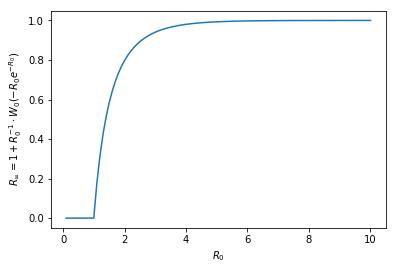

## Single Type

- A person has individual contact rate $$v$$, fixed throughout course of epidemic.
- The chance a transmission can occur along a contact is $$r$$
    - Transmission only actually occurs if one person is infected and the other is susceptible.
- Pandemic lasts for $$T$$ units of time (this will cancel out later)
- An infected person is infectious for $$\tau$$ units of time.
- Let $$R$$ be shorthand for $$R_\infty$$, the portion of the population that gets infected over the course of the epidemic.
- If you a connection at random with another person during the pandemic, there is a $$\tau R \over T$$ chance that your partner is infectious at the time of the connection and an $$r {\tau R \over T}$$ chance that they transmit to you.
- Thus tranmission events where you can get infected happen at rate $$v r {\tau R \over T}$$.
- Rate of tranmission *per infection* is $$\nu\equiv vr\tau$$

### Risk of infection.

Given discrete units of time of length $$dt$$, the infection will last $$T \over dt$$ units of time, and the chance of infection during a discrete unit of time is $$r {\tau R \over T} dt$$.

The chance you **don't** get infected is thus 

$$\lim_{dt\to 0} (1 - v r {\tau R \over T} dt)^{T/dt} = 
\lim_{dt\to 0} (1 - v r R \tau (dt/T))^{T/dt}
= e^{-vrR\tau }$$

Note that this is invariant of the length of the epidemic, and depends instead on the total infectious person time $$R\tau$$. It's also worth noticing $$vr\tau$$, which is the number of potential transmission events per infection, ie $$R_0$$.

If everyone has the same contact and transmission rates $$v,r$$, then each person has $$R$$ chance of becoming infected, and consistency requires that 

$$R = 1 - e^{-vrR\tau}$$

Note $$R=0$$ is always a possibility, corresponding to the case where the outbreak goes extinct before it transitions into an epidemic.
Nonzero (epidemic) solutions only exist if $$vr\tau > 0$$.
Given that an epidemic does occur, the portion of population infected is increasing in $$vr\tau$$ and can be solved numerically.
An exact solution for $$R > 0$$ is given by $$(vr\tau+W(-e^{-vr\tau}vr\tau)) \over vr\tau$$, where $$W$$ is the principal branch of the [product logarithm](https://en.wikipedia.org/wiki/Lambert_W_function).
Unfortunately, this can't be expressed in terms of more elementary functions, so we'll have to be happy with this.

<!--Holy canole. I already did all this back in november. Damn my memory is horrible. Something is really wrong with my mind.-->

### Chance an epidemic occurs

So $$e^{R_\infty R_0}$$ is chance I don't get sick.

But assuming that I do, how many do I transmit to? What's the child distribution?

Expected number of of child infections is $$\nu=vr\tau=R_0$$, so assuming a poisson process for spreading the disease, generating function for offspring distribution is 

$$g(\maltese) = e^{-R_0 (1-\maltese)}$$

The chance you personally don't infect anyone is $$g(0)=e^{-\nu}$$

Ultimate extinction probability $$g_\infty(0)$$, the chance that an outbreak goes extinct in finite time is $$1-R = -W(- \nu /e^\nu)/\nu$$. This is a consequence of the static perspective.

Examples:

| $$R_0$$ | $$g(0)$$ | $$1-R$$
|---|---|---|
| 0.5 | 60% | 100% |
| 1 | 37% | 100% |
| 1.05 | 35% | 91% |
| 2 | 14% | 20% |
| 3 | 5% | 6% |

For any $$\nu \in (0,1)$$, the function $$W(\frac{-\nu}{e^\nu})$$ will just be $$-\nu$$, which will cancel out in the equation for $$R$$, giving $$R=0$$ without caveat or special case. Nice and clean... somehow.

### Marginal Risk of Infection.

Want to endogenize $$v$$ with incentives. To do that, need some preferences over contact rate given risk. Following Kremer(96), one simple option is to have disutility simply equal to probability of getting infected.

Our little agent treats $$R,r,\tau$$ as exogenous and chooses $$v$$ to maximize 

$$U(v) \equiv u(v) - \Pr (\text{infected} | v) 
= u(v) - (1-e^{-vr\tau R}) \\
= u(v) -1 + e^{-vr\tau R}$$

where $$u(v)$$ is the utility from social activity in the absence of a contagion. 

<!--TODO: What if u(v) and p(v) are not additively seperable?-->

Another way of interpreting: agent gets +1 util for healthiness, and this util exponentially decays as contact rate goes up. What is the half-life of expected health? $$\frac{-\ln (1/2)}{r\tau R} \approx \frac{0.69}{r\tau R}$$. This means when $$r\tau R\approx 0.69$$, +1 contact per period halves remaining expected utility from health. Likewise, when $$rR\approx 0.69$$, +1 contact per *infectious time* halves remaining expected utility from health. This could be when everyone is eventually gets sick, but tranmission only occurs along 69% of contacts, or the disease always transmits but only has an ultimate prevalence of 69%.

The marginal utility from additional social contact is

$$u'(v) - r\tau R e^{-vr\tau R}$$

- can be either positive or negative
- within range, right term always negative
- potential optimums wherever normal marginal utility equal to marginal disease disutility
- marginal disutility from disease risk is strictly decreasing. Most of the risk is front loaded on those first few connections.

Marginal disutility from disease risk specificially (=marginal chance of getting sick) is 

$$\frac{d}{dv} 1-e^{-vr\tau R} = r\tau Re^{-vr\tau R}$$

### Second derivatives

Then as $$R$$ increases, we get that 

$$\frac{d}{dR} r\tau Re^{-vr\tau R} = -vr\tau \cdot r\tau R e^{-vrR\tau} + r\tau e^{-vr\tau R} \\
= r \tau e^{-vr\tau R} \cdot [1-vr\tau R]$$

This means that increasing the prevalence of the disease actually decreases the marginal disutility from the disease when $$v > 1/r\tau R$$, meaning that the rate of contact exceeds the inverse of (the total disease time times the chance an infectious contact transmits ("total expected transmission time"?)). Or similarly, when $$v\tau > 1/rR$$ meaning that the number of contacts per disease-period exceeds the inverse of (final size of pandemic times chance an infectious contact transmits).

<!--For this setup, this threshold happens to be where the disutility and marginal disutility cross. $$1-e^{-vrR\tau}$$ equals $$rR\tau e^{-vrR\tau}$$ when DISREGARD I AM A DINGUS-->

# TODO tomorrow:
- [x] Second derivatives
- [ ] what conditions needed on u to garuntee unique optimum in individual's prob
- [ ] Tie this back into the equilbrium setup
- [] Extend equilibrium to multiple types?

## Multiple types

R_1, R_2

Risk Pol = $$R_1 N_1 \tau_1 + R_2 N_2 \tau_2$$

